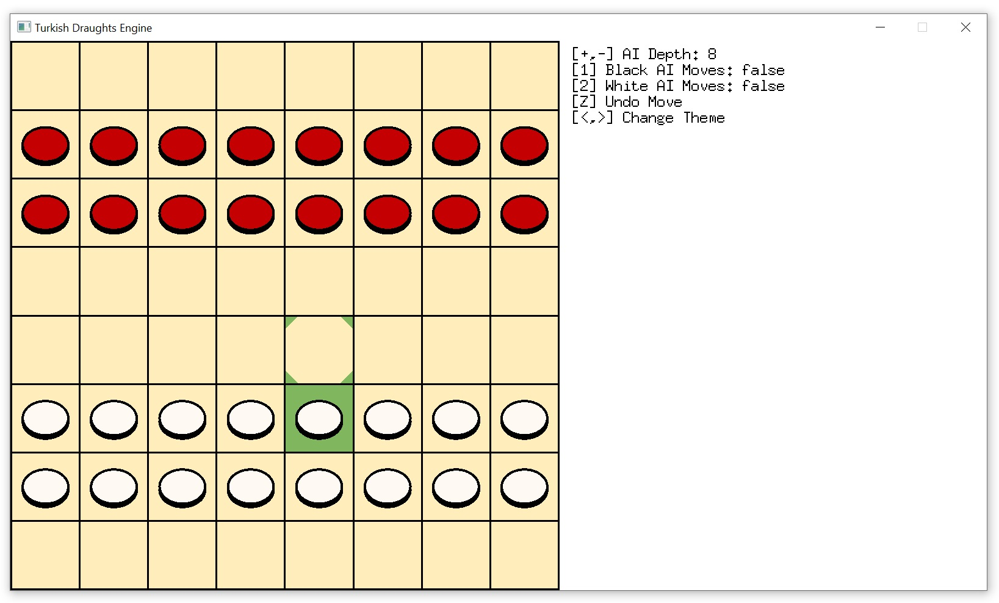
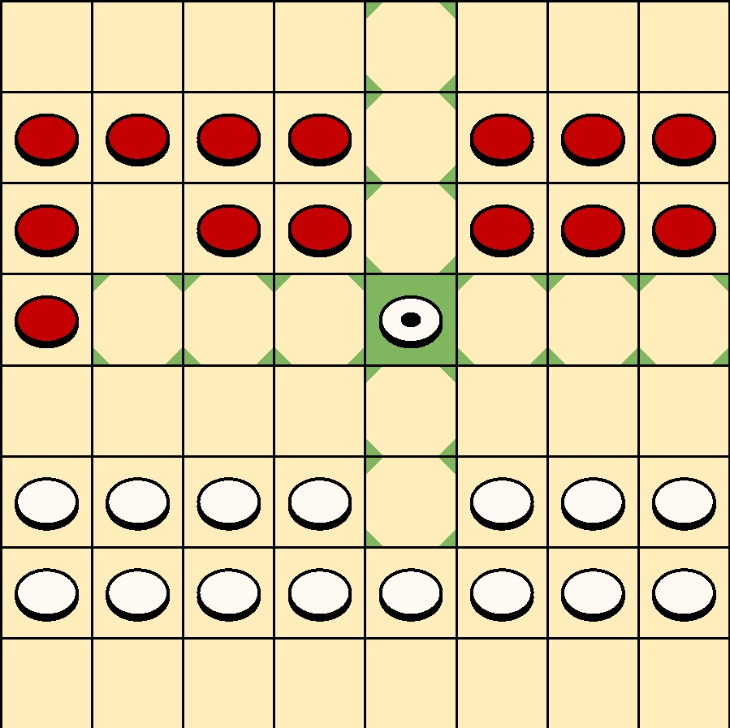
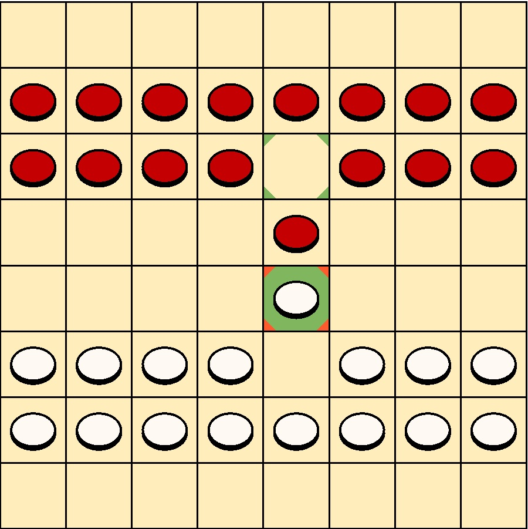
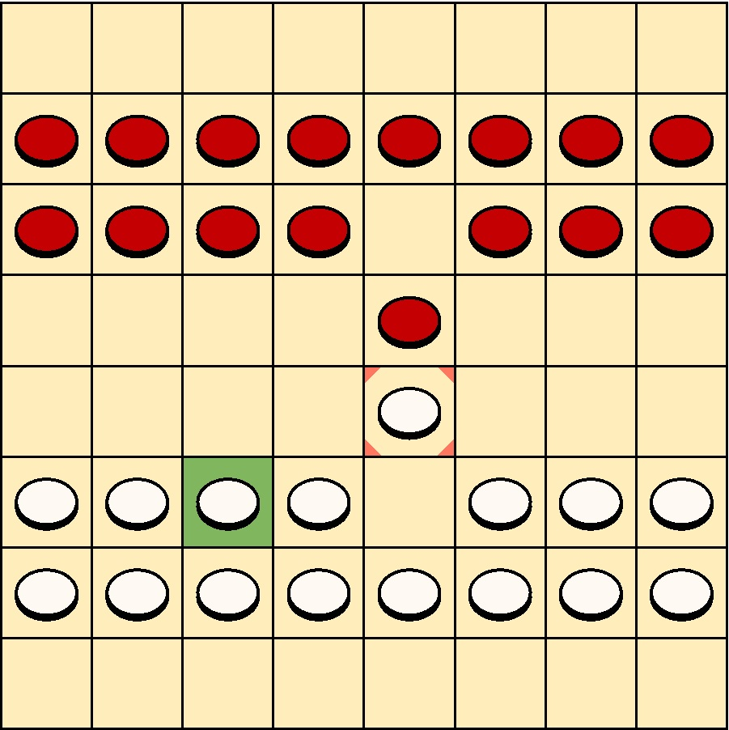
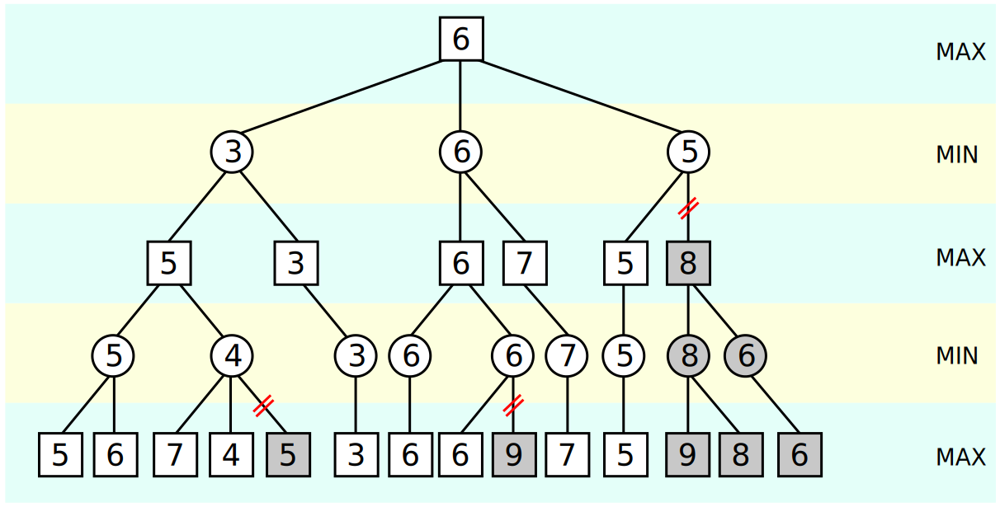

# TurkishDraughts

## Table of Contents
1. [Introduction](#introduction)
2. [Game Rules](#game-rules)
3. [Move Evaluation](#move-evaluation)
4. [Current Optimizations](#current-optimizations)
	1. [Alpha Beta Pruning](#alpha-beta-pruning)
	2. [Transposition Table](#transposition-table)
5. [Future Roadmap](#future-roadmap)

## Introduction

I wanted to write an ai for a board game but seeing that most like chess or checkers have been done before a million times over, I opted for a variant of checkers/draughts known as [Turkish Draughts](https://en.wikipedia.org/wiki/Turkish_draughts). The rules are fairly similar to traditional checkers/draughts with the main difference being pieces move along the axis as opposed to diagonally. This project includes the ai, and a frontend ui, to play the game against it or watch a match between the two ai.

## Game Rules

The game is similar to checkers except the pieces move along the axis. Non kinged pieces are not allowed to move backwards. Kinged pieces are able to move in any amount of moves in any direction.

 | 
:-: | :-: 

Taking pieces is like checkers where pieces jump over each other and need an empty square behind the piece they are attacking, and takes can be chained together. If a piece has the opportunity to take another piece it has to take that piece, if there are multiple combinations of takes you must choose the one that leads to the maximum amount of pieces captured.

*Cant move another piece because a take is possible example...*

 | 
:-: | :-:

A player wins when their opponent either has no pieces remaining, no possible moves, or one kinged piece against a non kinged piece.

## Move Evaluation

Minimax is a recursive tree search that searches every possibility a player has in a given turn repeatedly until a certain depth where it performs a simple evaluation of the outcome. Usually this is done by roughly adding up pieces and their values, and maybe something about their relative positions. It assumes that at every depth in the tree the player playing will always choose the move thats the best for them, and from that works its way up to find the best branch possible.

*By Nuno Nogueira (Nmnogueira) - http://en.wikipedia.org/wiki/Image:Minimax.svg, created in Inkscape by author, CC BY-SA 2.5, https://commons.wikimedia.org/w/index.php?curid=2276653*

While very thorough as its able to look many moves ahead the amount of boards that need to be evaluated increases exponentially with depth. This means that some optimizations and trade offs have to be made to reduce how many branches are searched in order to increase the amount of moves it can search ahead.

## Current Optimizations

There are many ways to optimize the move search each with their own trade offs. For a more comprehensive view of what kind of optimizations are possible a lot of research has been done in regards to [chess engines](https://www.chessprogramming.org/Search). The two main optimizations I have implemented are Alpha Beta Pruning and a Transposition Table.

#### Alpha Beta Pruning

Alpha beta pruning works by not exploring moves of a board when a result has been found that shows the ai would no longer pick this branch in the minmax tree, and thus further exploration is not needed. The result is the same as minimax but it prunes many branches of the tree and their cost would scale exponentially with depth so this results in a substancial performance increase. This approach has almost no downsides, with the added computation time of the alpha beta values being trivially small compared to the actual move search.

*By Nuno Nogueira (Nmnogueira) - https://commons.wikimedia.org/wiki/File:AB_pruning.svg#/media/File:AB_pruning.svg, CC BY-SA 3.0, https://commons.wikimedia.org/w/index.php?curid=3708424*

#### Transposition Table

Transposition tables store all previously explored boards and their values. Since there are multiple ways to reach the same board by refrencing the transposition table instead of re-evaluating that board many branches of the tree don't need to be re-evaluated.

 | 
:-: | :-:

The downside with this approach is simply there are more than 2^64 possible board configurations which means there are more board configurations than the size of addressable memory. As a result if you try to store every explored board you eventually run out of memory, so you have to introduce a hashing function that is intentionally causing collisions, or only store computationally expensive moves ie those above a certain depth. Either way this approach trades memory for computation time, and even with its limitations still provides a substancial performance increase. 

## Future Roadmap

//Reduce King Move Depth (#16)
//Change Board Value Heuristic To Promote Certain Piece Structures Or Levels Of Agression (#12)
//Various Minor Optimizations (#11)
